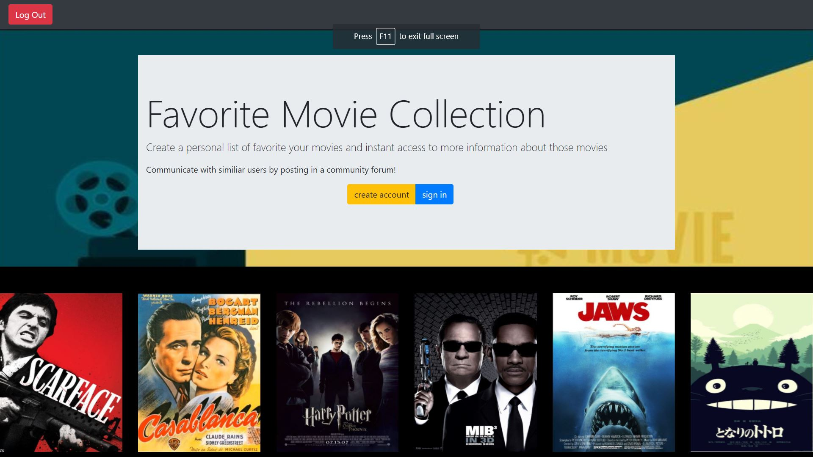
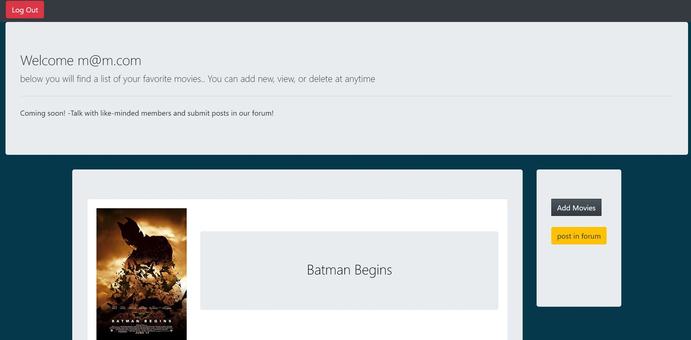
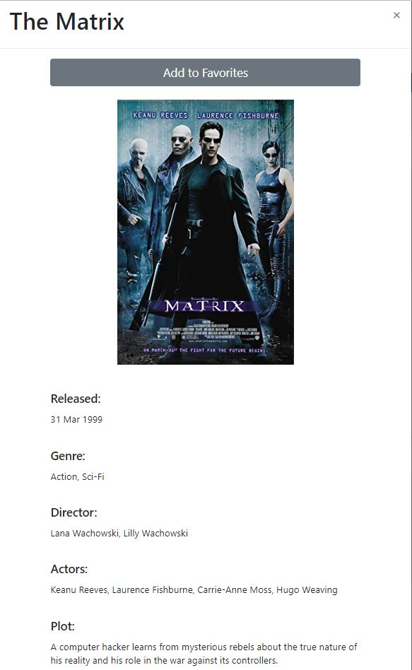
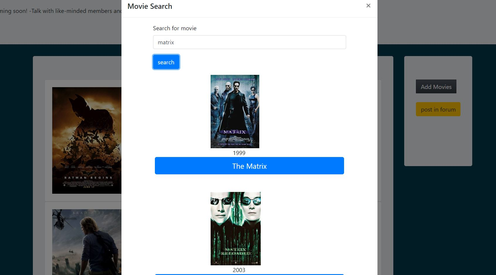

# movie_post
The Favorite Movie application allows users to have a space where a list of their favorite movies can be stored. 
  The program allows users to create a username and password so when they log in they have a personal space with movies 
  they selected as favorites to display. When logged in a user can search movies and gain information such as : title,
  year released, actors, plots, ratings, and box office stats. When the user chooses a favorite movie to add to their page
  they will have quicker access to this information.  The application will also have an area where posts can be made to 
  connect with other users.

## Technologies Used:
- HTML
- CSS
- JavaScript
- jQuery
- MySQL
- omdb API
- Sequelize
- express
- body-parser

## Installation

- In terminal type: npm install
- Direct browser to local host

## Screenshots

## Author
Michael Emmons
